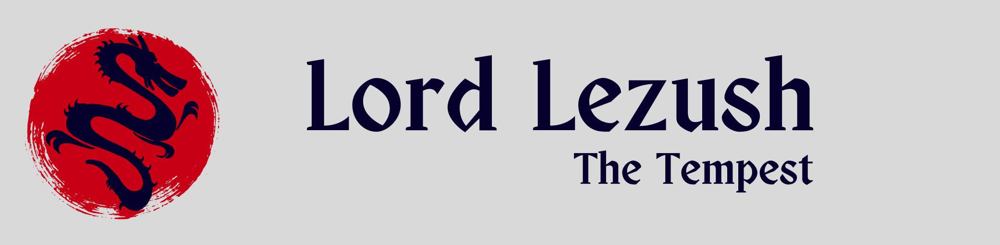

This repository houses a simple yet legendary Discord bot, Lord Lezush, who helps members of a server chill and find their groove through games. Get a chance to socialise and get to know the community members through this bot, which has been made for the communities on Discord by Lezush Developers Team.

## The Inspiration
The current times presents communities with challenges in spreading their messages and captivting audiences. Our bot attempts to aid in the process, by retaining users for a voice chat and keeping them busy with activities before the proceedings.

## The process
We referred the standard documentation for Python from [Python Docs](https://docs.python.org/3/). We looked into various API wrappers for the Discord API and settled with [Nextcord](https://pypi.org/project/nextcord/). The development procedure was undertaken by the team after assembling the requirements. The [Github REST API](https://docs.github.com/en/rest) was used to build commands for our bot.

## The Challenges
We faced serious challenges in enhacing the interactivity of the bot. The way the bot interacted with the user had to be redefined again, and that was challenging. But we managed to push through it with full might.

We managed to design a help page and added a feature to look at github profiles of the users through a command `l.github`. These took a us a great deal of effort to figure out, but it paid off in the end. The games were designed with a great deal of care, keeping in mind the users playing it. They do not have numerous prerequisites but present a the users with a fun-filled exoerience nonetheless.

## The Vision: What's up next for Lord Lezush?
We are envisioning a series of feature releases for out bot. The features will focus on making the bot more one-stop solution in community building and will could be able to change the way communities interact within themselves.